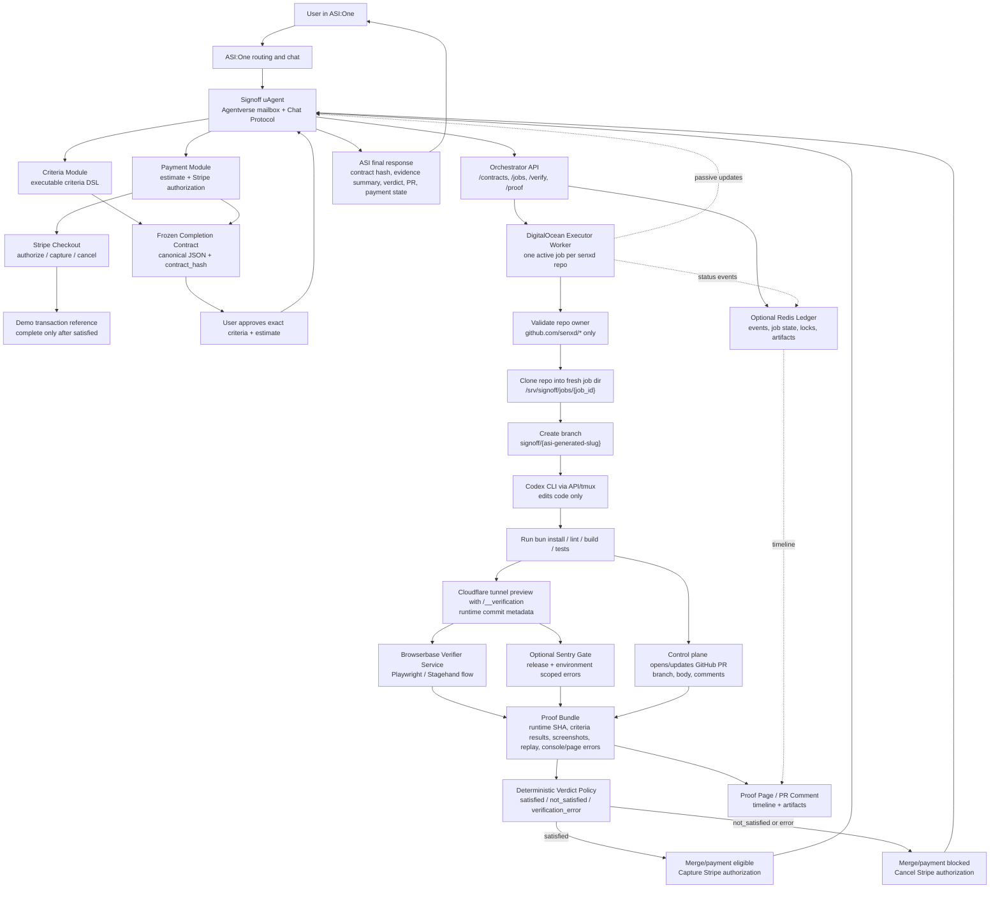

# Signoff Plan: Verified Completion Agent

## Product Thesis

Build **Signoff**, an ASI:One-discoverable agent for asynchronous, fixed-price software delivery with independent proof. Signoff refuses to call a software task done until independent browser execution verifies a user-approved completion contract.

The project is not a general coding-agent platform and it is not "between Lovable and Claude Code." It is a different operating model: a technical user delegates a bounded software task, approves one fixed contract, leaves the execution unsupervised, then reviews a PR and proof packet instead of babysitting the agent conversation.

Initial target users are engineering teams: technical founders, agencies, senior/product engineers, and lean engineering leads who can evaluate a PR but do not want to supervise a coding agent step by step. Large-enterprise deployment is an expansion path, not the hackathon pitch.

The narrow demo workflow is for Next.js tasks: a user asks for a change, Signoff creates an executable acceptance contract, the user approves it, a coding executor makes the change, GitHub captures the deliverable, Browserbase verifies the exact deployed commit, and deterministic policy returns a verdict.

Core loop:

```text
intent -> frozen contract -> code change -> commit-bound browser verification -> deterministic verdict
```

## Winning Framing

The sharp abstraction is a completion contract:

```text
The agent cannot change the test after seeing its work, and the executor cannot certify its own output.
```

The agent converts a natural language request into:

- explicit executable acceptance criteria
- an executable workflow
- a browser-verifiable outcome
- a deterministic verdict
- an auditable proof bundle

The strongest pitch:

```text
Signoff lets engineering teams delegate bounded product changes without supervising a coding agent. From ASI:One, a lead approves a fixed-price completion contract; Signoff opens the PR, independently runs the finished workflow in Browserbase, and returns a review-ready evidence packet. Stripe is captured only when the agreed checks pass.
```

Closing line:

> Delegate the task. Review the proof, not the conversation.

Do not expose "pay less for lower quality" routing. Signoff may choose cheaper/faster executors internally, but users buy a complete contract. If budget is smaller, reduce scope, not the quality bar.

## Award Targets

Primary:

- Fetch / Agentverse: ASI:One intent-to-action flow, Chat Protocol, contract adjudication.
- Ddoski's Toolbox: developer workflow tool.
- Browserbase: independent browser verification, screenshots, replay.
- Sentry: failure-path runtime gate and proof that broken work blocks completion.
- Stripe: test-mode Checkout authorization captured only after verified completion.
- Redis: job ledger and audit timeline, only if it can be made visible without diluting Fetch.
- Solo / Beginner: eligible category.

Do not target Anthropic's prize narrative directly unless the official criteria match developer tooling. Anthropic/OpenAI/Claude/Codex can still be used as executor technology.

## Fetch Submission Constraints

The Fetch track should be treated as the base product, not a wrapper around the runner.

Mandatory requirements from the Fetch hackpack:

- register at least one agent on Agentverse
- implement the Agent Chat Protocol
- make the agent discoverable and directly usable through ASI:One
- demonstrate meaningful tool execution or agent-to-agent orchestration
- complete the primary user workflow without requiring a custom frontend
- submit a public GitHub repository with run/test instructions

Submission artifacts:

- public ASI:One shared chat session URL showing the complete workflow
- Agentverse Agent Profile URL for Signoff
- public GitHub repository URL
- short 3-5 minute demo video
- concise problem, target user, and produced outcome description

Agentverse README requirements:

- include agent name and address
- explain required external resources
- include Innovation Lab and hackathon badges:

```md


```

## Scope

Supported in the hackathon demo:

- Next.js repo
- TypeScript
- Bun for project commands where possible
- small UI/full-stack tasks
- GitHub branch and PR
- Browserbase verification
- Sentry runtime gate for the failure-path demo
- Stripe Checkout with manual-capture PaymentIntent
- ASI:One interaction
- proof artifact or PR comment

Canonical demo project:

```text
Local checkout: /path/to/finance
GitHub repo: https://github.com/senxd/finance-2
GitHub owner: senxd
GitHub repo name: finance-2
App name: finance
Stack: Next.js 16, React 19, TypeScript, Bun, Convex
```

The primary demo is the **Watchlist mobile completion contract**. Use `/watchlist`, not `/paper`, as the main green/red demo. It is guest-capable, can be seeded with Browserbase `localStorage`, and gives objective UI criteria without requiring auth or brokerage data.

Primary task prompt:

> Make the Watchlist page work well on mobile by showing a compact card layout below 640px while preserving the desktop table on larger screens.

Frozen success criteria:

- `/watchlist` loads at desktop and mobile.
- Browserbase seeds localStorage with `["NVDA","AAPL","MSFT","SPY"]`.
- At 390px width, page has no horizontal overflow: `document.documentElement.scrollWidth <= window.innerWidth`.
- At mobile width, visible ticker cards include `NVDA`, `AAPL`, and `MSFT`.
- At desktop width, table layout still exists.
- Screenshot and Browserbase replay are attached.
- Build passes and PR is opened.

Manufactured failure case:

> Adds a "Mobile optimized" header or changes spacing, but does not replace the mobile table layout.

Expected failure result:

> Build passed. `/watchlist` loaded. Tickers rendered. Criterion 3 failed: `scrollWidth = 927`, `clientWidth = 390`. Verdict: `not_satisfied`.

The failure case is central because it proves Signoff blocks release on a specific agreed predicate, not only on crashes.

Secondary demo: **Paper Trading proof**. Use `/paper` only if auth/test-account setup is stable. It is visually richer but riskier.

Secondary task:

> Add a compact "Account Health" strip to Paper Trading showing buying power, open positions, and realized/unrealized split.

Secondary criteria:

- demo user signs in
- `/paper` loads
- seeded account name appears
- new "Account Health" section appears
- section shows Buying power, Open positions, and Unrealized
- no horizontal overflow at 390px
- build passes and PR is opened

Out of scope:

- arbitrary repo support
- arbitrary programming languages/frameworks
- complex infra migrations
- multi-user production security
- production-grade real-money escrow
- building a new coding agent loop from raw model APIs
- custom frontend as the primary interface

## Final Decisions

This is the locked implementation plan for the hackathon.

### Agent Framework

Use lightweight Fetch `uAgents` for the ASI-facing layer.

`uAgents` is Fetch's lightweight Python agent framework for building agents that can register with Agentverse, speak the Agent Chat Protocol, and become usable through ASI:One. For this project, `uAgents` should not own the whole coding stack. It should own the ASI-native control plane:

- receive ASI:One chat messages
- create and confirm the completion contract
- freeze and hash the approved contract
- coordinate role-specific modules/services
- dispatch the hosted executor job
- surface passive progress updates
- validate evidence provenance
- explain deterministic verdict policy
- mark merge/payment eligibility

Do not introduce CrewAI, LangGraph, or a heavy multi-agent framework unless the core workflow is already complete.

### Agent Count

Submit one polished Agentverse agent: Signoff.

Internally, keep the specialist capabilities as lightweight modules/services/workers:

- criteria module
- pricing/payment service
- executor worker
- browser verifier service
- Sentry gate
- deterministic verdict policy
- GitHub service

Only add a second submitted Agentverse profile if the main workflow is stable early. A second Verifier uAgent is optional; it must have no repository-write credentials and should receive only the frozen contract hash, commit SHA, and preview URL.

### Payment

Use Stripe Checkout with a manual-capture PaymentIntent as the payment path for the demo. This is a real Stripe test-mode payment rail, not simulated escrow: the buyer authorizes before execution, Signoff captures only after deterministic verification passes, and Signoff cancels the authorization when verification fails or errors.

The payment story:

```text
quote -> Stripe Checkout authorization -> execute -> verify -> capture if satisfied
quote -> Stripe Checkout authorization -> execute -> verify fails/errors -> cancel authorization
```

Use precise language:

- "Stripe test-mode authorization for the frozen contract"
- "manual capture after verified completion"
- "release eligible" or "completion invoice eligible"

Do not claim escrow or refund. It is accurate to say "authorize", "capture", and "cancel authorization" because Stripe performs those test-mode actions.

Payment should demo the verified-completion business model, but it must not compromise the contract-to-verdict flow.

### Merge Policy

Default to merge-eligible, not automatic merge.

Signoff should:

- open/update the PR
- verify a specific commit SHA
- create or report a `verified-completion / satisfied` status/check for that SHA if implemented
- mark the PR merge-eligible only when verdict is `satisfied`
- block merge authorization when verdict is `not_satisfied` or `verification_error`

If automatic merge is added, require explicit user instruction and verify that PR head SHA still equals the verified commit SHA at merge time.

### Execution

Use the DigitalOcean droplet runner as the live executor.

The runner should use Codex CLI or Claude Code CLI as a black-box code editor, then run deterministic surrounding steps itself:

- validate `github.com/senxd/*`
- default to `github.com/senxd/finance-2`
- clone into a fresh job directory
- create `signoff/{asi_generated_slug}`
- run Codex CLI programmatically or through a tmux console session with subscription auth
- run `bun install`, build, lint, or tests as available
- for `finance-2`, prefer `bun run lint:fast`, `bun run build`, and `bun run dev:frontend` for preview when Convex is not needed
- expose preview through a Cloudflare tunnel by default
- return patch/commit artifacts for control-plane push/PR handling
- send status events back to the Orchestrator

This avoids building a new coding-agent loop during the hackathon.

The executor sandbox must not contain uAgent seed, payment credentials, verifier signing keys, GitHub merge authority, or broad push credentials. It should only operate inside its delegated worktree and branch.

### Browser Verification

Browserbase remains the proof layer.

Primary verifier implementation should use Browserbase SDK plus Playwright-style checks. `agent-browser` is the setup/operator fallback and can run against Browserbase with `AGENT_BROWSER_PROVIDER=browserbase`. The broken Codex Chrome plugin is not part of the plan.

### Passive Updates

Passive progress updates are part of the product, not incidental logging.

The runner emits structured events, and the Orchestrator converts them into concise ASI-visible updates. This is the clearest way to make the workflow feel like delegated agent work instead of a hidden backend job.

### Lowest-Effort Resolutions For Open Issues

These choices are locked for the next implementation pass unless they fail in testing.

- GitHub connection: preconnect `senxd/finance-2` for the hackathon using the existing narrowly scoped credential path. Build the GitHub App model into the plan and schema, but do not put live GitHub App installation in the critical demo path until executor and PR flow are stable.
- GitHub App credentials: create the app and preinstall it on `senxd/finance-2` if time allows, using the current public tunnel or a stable named tunnel for callbacks. Treat this as hardening, not the first blocker.
- ASI shared-chat validation: use `agent-browser` to open ASI:One, invoke Signoff, send a representative prompt, confirm the transcript, and create the public shared chat URL. Use computer use only if login/passkey/your password manager blocks browser automation.
- Sandbox executor: use the existing DigitalOcean droplet and Codex CLI subscription auth. Do not build a custom model loop. One allowed repo, one branch prefix, one active job per repo.
- Preview: use Cloudflare tunnel. A quick tunnel is acceptable for development; use a named/stable tunnel if GitHub callbacks or demo links need durability.
- Browser automation: use local `agent-browser` for ASI/Stripe/GitHub UI setup, but close it before product Browserbase verification because the Browserbase project currently has a one-session concurrency limit.
- Sentry and Redis: keep deferred unless the core Watchlist success/failure and ASI transcript are stable.
- Payment: Stripe manual-capture remains load-bearing. ASI may display Payment Protocol-style state messages, but the real demo rail is Stripe test mode.

The next implementation milestone is not "more planning"; it is the Watchlist vertical slice:

> read-only repo survey -> fixed Watchlist contract -> Stripe authorization -> sandbox implementation -> PR/preview -> Browserbase criteria proof -> deterministic verdict -> capture/cancel -> ASI proof packet.

## High-Level Architecture

Use ASI/Agentverse as the control plane and keep expensive execution/evidence tools behind it.

```text
ASI:One
  -> Signoff uAgent
      -> criteria module
      -> payment service
      -> executor worker
      -> browser verifier service
      -> optional Sentry gate
      -> deterministic verdict policy
```

The important division:

```text
ASI decides what the job means, what evidence is required, and whether it is merge/payment eligible.
The droplet, GitHub, Browserbase, Sentry, and Redis perform side effects and return evidence.
```

Expanded execution path:

```text
ASI:One chat
  -> Signoff uAgent
  -> criteria module generates executable criteria DSL
  -> user approves the exact contract
  -> Signoff freezes canonical JSON and contract_hash
  -> payment module creates Stripe Checkout manual-capture authorization
  -> Orchestrator API
  -> DigitalOcean droplet runner
  -> Codex/Claude CLI executor
  -> GitHub branch/PR
  -> immutable deployment / preview URL
  -> Browserbase verifier checks runtime SHA and criteria
  -> optional Sentry gate
  -> deterministic verdict policy returns satisfied/not_satisfied/verification_error
  -> Stripe authorization captures/cancels according to verdict
  -> ASI:One final response with verdict, PR, proof, and merge/payment eligibility
```

Forwarding to `/jobs` is acceptable as an implementation detail. It must not be the semantic center of the product. Signoff should create the contract, dispatch `/jobs`, receive progress, validate evidence, and explain deterministic verdict policy.

## Architecture Diagram



## Component Roles

### Signoff uAgent

The ASI entrypoint and main chat participant.

Responsibilities:

- receive the user's task and `senxd/*` repo
- decide whether the request fits the supported Next.js scope
- ask the criteria module for executable completion checks
- ask the payment service for estimate and payment state
- present the contract for user confirmation
- freeze canonical JSON and publish `contract_hash`
- dispatch the executor worker
- surface passive progress updates
- request Browserbase/Sentry verification
- validate evidence provenance and schema
- explain deterministic verdict policy
- return the final verdict in ASI:One

### Criteria Module

Generates a short deterministic criteria set from the user's intent.

Responsibilities:

- produce 4-6 machine-checkable checks as executable criteria DSL
- avoid subjective quality claims
- make browser-verifiable criteria when possible
- include routes, viewports, actions, and observable assertions
- include human-readable descriptions for ASI presentation

### Pricing / Payment Service

Makes payment meaningful without making payment rails fragile.

Responsibilities:

- estimate rough price/time/risk before execution
- create a Stripe Checkout Session with manual capture
- bind the Checkout Session and PaymentIntent to the job/contract
- require authorization before executor work starts
- capture only after verdict is `satisfied`
- cancel authorization when verdict is `not_satisfied` or `verification_error`

### Executor Worker

A background job with subagent-like behavior.

Responsibilities:

- run on the DigitalOcean droplet
- validate the repo is under `senxd/*`
- clone the repo into an isolated job directory
- create an `agent/{job_id}` branch
- run Codex CLI or Claude Code CLI
- run build/check commands
- start/deploy a preview
- open/update a GitHub PR
- post high-signal status updates
- return implementation SHA, deployment ID, preview URL, artifacts, and logs to Signoff

The executor worker does not decide completion and must not receive payment, verifier-signing, uAgent seed, or merge credentials.

### Browserbase Verifier Service

A specialized verification capability, analogous to CareLoop's specialist agents.

Responsibilities:

- open the preview URL in Browserbase
- verify the runtime commit SHA matches the expected implementation SHA
- execute the frozen criteria DSL with Playwright/Stagehand-style browser actions or `agent-browser`
- capture screenshots and replay URLs
- report per-criterion observed values and predicate status

Browserbase is the remote browser measurement runtime. It is the ruler and recorder, not the judge.

Implementation note:

```text
Primary code path: Browserbase SDK + Playwright-core from the verifier service.
Fallback/operator path: agent-browser with AGENT_BROWSER_PROVIDER=browserbase.
Broken path: Codex Chrome plugin, until the runtime sandboxPolicy issue is fixed.
```

The `agent-browser` fallback is useful during setup because it can navigate, snapshot, click, record video, and capture screenshots without relying on the broken Chrome plugin. In the shipped demo, the verifier should still write structured per-criterion results so the verdict policy has machine-readable evidence.

### Sentry Gate

A secondary runtime-quality gate and sponsor-aligned proof source.

Responsibilities:

- tag preview runs with job-specific release/environment values
- detect new error/fatal events during Browserbase verification
- return runtime blockers to the proof bundle

Sentry can live inside the runner/workflow and report evidence back; it does not need to be an ASI agent.

### Deterministic Verdict Policy

Reads the proof bundle and mechanically derives the verdict.

Responsibilities:

- compare criteria with Browserbase/Sentry/build evidence
- return `satisfied`, `not_satisfied`, or `verification_error`
- explain the failed criterion when blocked
- explicitly refuse completion when evidence is missing or failed
- never let an LLM override the verdict

### Redis Ledger

Optional supporting infrastructure, not the orchestration brain.

Responsibilities:

- durable job state
- event timeline for passive updates
- artifact index
- payment state mirror
- per-repo locks

Do not let Redis compete with Fetch in the story. Fetch/ASI orchestrates; Redis records.

## Hosting And Execution

Use a trusted DigitalOcean droplet as the first hosted executor sandbox for the live demo.

Why:

- persistent Codex/Claude CLI setup
- easier background jobs and progress streaming
- easier tunnel/preview management
- lower latency than waiting on GitHub Actions
- one known runner can be rehearsed repeatedly before judging
- simpler live-demo control

The droplet is not a production multi-tenant sandbox. For the hackathon, scope it to a trusted allowlist:

```text
Allowed GitHub owner: senxd
Allowed repo pattern: github.com/senxd/*
One active job per repo
Fresh working directory per job
Branch prefix: signoff/{asi_generated_slug}
Cleanup after artifact capture
```

The runner job:

```text
receive frozen contract from Signoff
validate repo owner is senxd
clone repo into /srv/signoff/jobs/{job_id}
create branch
run Codex/Claude CLI with goal and criteria
run build/lint/tests
start cloudflared preview with /__verification metadata
return patch/commit artifacts to control plane
emit progress updates throughout
return implementation SHA, deployment ID, and preview URL to Signoff
```

GitHub Actions remains a backup/future reproducibility path, but it is not the live-demo default.

## Droplet Runner Scope

The droplet runner should behave like a background subagent/job, not a single blocking function call.

State model:

```text
ExecutorJob
  id
  repo
  branch
  criteria
  status
  current_step
  heartbeat
  progress_summary
  artifacts
  failure_reason
```

The runner posts high-signal updates back to Signoff:

```text
job.accepted
repo.cloned
branch.created
executor.started
files.changed
build.started
build.passed
preview.ready
pr.opened
browserbase.started
verification.finished
```

Signoff translates those into concise ASI updates:

```text
I cloned the repo and created the branch.
The executor is applying the accepted contract now.
The build passed; I am sending the preview to Browserbase.
I cannot mark this complete because the mobile viewport failed the no-overflow check.
```

This makes the execution feel like delegated agent work that can be inspected without letting the executor decide completion.

## GitHub Flow

GitHub is the concrete deliverable and must be part of the ASI workflow, not hidden behind the backend.

ASI-level flow:

```text
1. User gives ASI a task and repo under senxd.
2. Signoff checks whether GitHub is connected.
3. Signoff resolves and pins `base_commit_sha`.
4. Read-only repo survey inspects routes, scripts, tests, auth, and relevant files.
5. Optional Browserbase baseline confirms the requested value is not already true.
6. Criteria module creates executable acceptance checks and quote.
7. User confirms the exact contract and estimate.
8. Signoff freezes canonical JSON and records `contract_hash`.
9. Stripe authorization occurs.
10. Executor worker receives write capability and prepares changes on `signoff/{asi_generated_slug}`.
11. Control plane pushes the branch and opens a draft PR.
12. Preview exposes /__verification with runtime commit metadata.
13. Browserbase/Sentry proof updates the PR comment.
14. Deterministic policy returns satisfied/not_satisfied/verification_error.
15. Signoff marks the PR merge-eligible only after satisfied.
```

GitHub authentication options:

```text
Hackathon critical path: preconnected senxd/finance-2 credential controlled by Signoff.
Target design: GitHub App installed only on selected repositories.
Fallback: gh CLI authenticated on the droplet for senxd.
```

For the hackathon, start the demo from:

> GitHub is connected. I inspected `senxd/finance-2` at commit `{base_commit_sha}` read-only and prepared this completion contract.

Do not make a live GitHub authorization ceremony part of the critical demo path. If time allows, create and preinstall the GitHub App on `senxd/finance-2`, but the reliable demo path can use the existing selected-repo credential.

Target GitHub App connection flow:

```text
ASI response -> one-time Signoff connection URL -> GitHub App installation page
-> user selects account/org and repository -> GitHub redirects to Signoff callback
-> callback verifies signed state and authenticated GitHub user -> store installation/repo mapping
-> return to ASI
```

Required GitHub App validation:

- signed single-use `state` with connection id, ASI sender/conversation, expiry, and nonce
- exchange returned OAuth code for a temporary GitHub user token
- verify the app installation is accessible to that authenticated user
- store GitHub user id, installation id, selected repository id, and ASI identity mapping
- discard the user token unless user-delegated actions are needed

Separate short-lived installation tokens by role:

- repo survey token: Contents read, Metadata read
- executor token: Contents read/write, Pull requests read/write, scoped to selected repo/branch
- verifier/control token: Checks read/write and optional PR comment write

Judge-facing answer:

> Criteria generation uses a repository-scoped, read-only view pinned to the base commit. Write capability is not issued until the contract is approved and Stripe is authorized.

PR artifacts:

```text
branch: signoff/{asi_generated_slug}
PR title: Verified contract: {short goal}
PR body: contract hash, criteria, build status, base commit, verifier digest
PR comment: Browserbase replay, screenshots, observed values, verdict, payment state
GitHub status/check: verified-completion / satisfied, tied to verified commit SHA
```

Default endpoint:

```text
Signoff marks the PR merge-eligible. The user performs the final merge.
```

If automatic merge is added later, Signoff must verify that the PR head SHA still equals the verified implementation SHA immediately before merging.

## Executor Strategy

Use Codex CLI or Claude Code CLI as a black-box executor. Do not implement the agent loop from scratch.

Lowest-effort executor wrapper:

```text
git switch -c signoff/$ASI_GENERATED_SLUG
run codex/claude with goal and criteria
bun install if needed
bun lint/build/test
git add .
git commit
return patch/commit metadata to control plane
```

Keep branch validation, push, PR creation, GitHub checks, merge eligibility, and payment outside the coding agent. The agent should focus on editing code inside its delegated branch.

Use one known Next.js demo repo and one rehearsed task for the main demo.

## ASI / Fetch Agent

Use local uAgent + Agentverse Mailbox for fastest setup, with Signoff as the primary submitted Agentverse profile.

Minimum requirements:

- `mailbox=True`
- `publish_agent_details=True`
- `readme_path`
- Chat Protocol
- `publish_manifest=True`
- clear Agentverse README
- good keywords and description

Fetch-side responsibilities:

- receive user intent through ASI:One
- generate or present a completion contract
- explain the criteria
- freeze canonical JSON and show `contract_hash`
- create price/payment request
- start the job
- stream passive progress updates
- invoke verifier separately from executor
- receive proof bundle directly from verifier
- apply deterministic verdict policy
- mark merge/payment eligibility
- capture/cancel Stripe payment state
- report final result in ASI:One

Avoid making the Fetch agent a dumb router. Signoff should own contract creation, evidence intake, verdict explanation, and release authority.

Past-project lesson:

- Pols 15 made Agentverse roles visible through an orchestrator plus specialists.
- CareLoop made specialist capabilities feel like plugins behind a single chat flow.
- MintCondition's visible multi-agent reasoning is a strong UX reference.
- Autopsy shows that the failure path can be the product.

For Signoff, visible passive updates are a feature. The user should see high-signal progress in ASI without reading raw logs.

## Completion Contract

Each task produces a contract before work starts.

Contract fields:

```text
contract_id
contract_version
contract_hash
contract_schema_version
goal
repo
stack
base_commit_sha
executable criteria DSL
required evidence policy
verifier implementation digest
approver ASI/user address
approval message ID
maximum repair attempts
release rule
stripe checkout/session/payment intent reference
status
```

Status states:

```text
quoted
authorized
building
verifying
satisfied
not_satisfied
verification_error
repairing
merge_eligible
payment_complete
payment_cancelled
```

Example UI contract:

```text
Goal:
Improve the mobile dashboard loading state.

Machine-checkable criteria:
- /dashboard loads successfully
- page has no horizontal scroll at 390px
- loading state appears while data is delayed
- dashboard content appears after data resolves
- primary CTA is visible in viewport
- no browser page errors during smoke flow

Human-review artifacts:
- before/after screenshots
- Browserbase replay
- GitHub PR diff summary
```

Important framing:

```text
We do not prove subjective design quality. We enforce pre-agreed, machine-checkable completion criteria and package evidence for human review.
```

## Criteria Generation

Keep criteria to 4-6 deterministic checks.

Generation rules:

- routes become smoke tests
- nouns become semantic anchors
- verbs become Playwright actions
- async data becomes loading/empty/error checks
- mobile/responsive language adds viewport and horizontal-scroll checks
- accessibility-sensitive UI adds accessible-name or axe checks

Criteria must have both human-readable descriptions and executable DSL. The DSL is what gets hashed and converted into verifier code.

Criteria shape:

```json
{
  "id": "dashboard-loading-state",
  "route": "/dashboard",
  "description": "Dashboard has no horizontal overflow at 390px",
  "viewport": {"width": 390, "height": 844},
  "actions": [{"type": "goto", "route": "/dashboard"}],
  "measurement": "document.documentElement.scrollWidth",
  "operator": "<=",
  "expectedFrom": "document.documentElement.clientWidth",
  "maxRuntimeMs": 10000,
  "requiredArtifacts": ["observed_values", "screenshot", "browserbase_replay"]
}
```

The criteria module should generate this before any work begins. The user confirms the exact criteria and price before the executor worker starts. After approval, the canonical JSON is frozen and hashed; repair attempts keep the same `contract_hash`.

## Repair Loop

The repair loop is bounded and deterministic.

Rules:

- 3 total implementation attempts maximum: initial attempt plus up to 2 repairs
- only `not_satisfied` can trigger code repair
- `verification_error` retries verification or pauses for operator/user action; it must not blame the executor or change code automatically
- every repair keeps the same `contract_hash`
- every repair creates a new implementation commit SHA
- every repair reruns all criteria, not only the failed criterion
- payment and merge eligibility remain blocked until a full verification run returns `satisfied`

ASI wording after a repairable failure:

> Attempt 1 is `not_satisfied`. Criterion 3 failed: mobile no-overflow at 390px. I cannot release payment or mark the PR merge-eligible. I am sending the evidence back for repair attempt 2 under the same contract.

ASI wording after final refusal:

> Attempt 3 is `not_satisfied`. The contract has reached its repair limit. Merge and payment remain blocked.

## Browserbase Verification

Browserbase is the primary proof layer and should be presented as a specialist verifier plugin.

Use Browserbase to:

- open the preview URL
- fetch `/__verification` and assert runtime commit metadata
- run the frozen criteria DSL
- check machine criteria against observed values
- capture desktop/mobile screenshots
- record browser session replay
- provide live/debug link if available

Recommended checks:

- route loads
- heading/CTA/semantic anchors visible
- no horizontal scroll
- loading state appears under delayed response
- content appears after response
- no unexpected `pageerror`
- no unexpected console error
- primary CTA remains in viewport

Screenshots and replay are evidence for human review; Playwright assertions produce the pass/fail result.

Browserbase does not need to be the ASI agent. It can run from the droplet or backend, but the executor should not be allowed to certify its own output. Preferred flow:

```text
executor returns implementation_sha, deployment_id, preview_url
Signoff invokes Browserbase verifier separately
Browserbase checks runtime_commit_sha == expected implementation_sha
verifier returns structured evidence
deterministic verdict policy computes result
```

If runtime commit metadata is missing or mismatched, the verdict is `verification_error`.

## Sentry Gate

Sentry is part of the secondary sponsor strategy and valuable in the failure path.

Use it to show:

```text
Browserbase triggers a crash
Sentry catches the error
completion is blocked
contract is marked not_satisfied or verification_error
```

For each job, tag events:

```text
SENTRY_RELEASE=signoff-job-123
SENTRY_ENVIRONMENT=preview-job-123
proof_run_id=job-123
```

After Browserbase runs, query for:

```text
release:signoff-job-123
environment:preview-job-123
level:error or fatal
time window after proof run starts
```

Poll for 60-90 seconds because event ingestion can lag.

If time is tight, Sentry should be implemented as a proof-bundle gate, not a separate ASI agent. Its job is to make runtime failure visible and block completion.

## Redis Ledger

Redis is useful but should not dominate the pitch, because Fetch/ASI must remain the orchestration story.

Use Redis for:

- job state
- proof timeline
- payment/demo settlement state
- artifact URLs
- worker events
- locks

Recommended data model:

```text
Hashes:
job:{id}

Streams:
job:{id}:events
jobs:requested

Locks:
lock:job:{id}
```

Event examples:

```text
contract.created
contract.authorized
workflow.started
executor.finished
pr.opened
preview.ready
browserbase.started
browserbase.passed
sentry.failed
contract.release_eligible
contract.not_satisfied
contract.verification_error
```

Pitch Redis as the real-time audit trail for long-running agent work, not as a cache.

If Redis is included for the prize, make it visible as the event stream powering passive ASI updates and the durable audit trail for proof artifacts. If that cannot be implemented cleanly, defer it.

## Payment / Settlement

Payment processing is a core differentiator because it makes the business model outcome-based: pay for verified completion, not tokens or time. The demo rail is Stripe test mode with manual capture.

Use Stripe Checkout as the payment authorization surface. The Checkout Session creates a manual-capture PaymentIntent.

Happy path:

```text
quote -> Stripe Checkout authorization -> work starts -> verification satisfied -> capture PaymentIntent
```

Failure path:

```text
quote -> Stripe Checkout authorization -> verification not_satisfied or verification_error -> cancel authorization
```

Use language carefully:

- "Stripe test-mode authorization for the frozen contract"
- "manual capture after verified completion"
- "release eligible"
- "completion invoice eligible"

Do not call it escrow or refund. It is accurate to say authorization, capture, and cancellation because those are real Stripe test-mode states.

Payment supports the core business-model story:

```text
The agent is paid for verified completion, not tokens.
```

Recommended hackathon implementation:

```text
MVP:
  Stripe Checkout manual-capture authorization

Strong:
  ASI transcript shows authorization, verification, capture/cancel state

Best:
  Stripe webhooks plus sync endpoint, with replayable success and failure runs
```

Do not let payment UI flakiness compromise the contract-to-verdict flow. Payment is valuable, but deterministic verification is the core.

Payment should be visible in ASI:

```text
Estimate: $20 completion authorization
Stripe Checkout authorization created
PaymentIntent authorized
Work submitted
Verification passed
Stripe authorization captured / completion invoice eligible
```

Failure path:

```text
PaymentIntent authorized
Verification failed or errored
Stripe authorization cancelled / completion invoice blocked
```

## Proof Artifact

The ASI transcript is the primary demo artifact. Each job should also have a proof artifact, PR comment, or static JSON record for inspection.

Contents:

- contract goal
- contract hash
- verified commit SHA
- runtime commit SHA
- criteria checklist
- deterministic verdict
- branch/PR link
- build result
- Browserbase screenshots
- Browserbase replay/live link
- observed values for each machine criterion
- Sentry gate result if applicable
- timeline
- payment/demo state

The human-readable layer should be concise, but every claim must map back to machine evidence.

## Demo Strategy

Do not rely on a full live workflow finishing during judging.

Prepare 6-8 labeled runs. Each run must be tagged by:

- guest vs logged-in
- success vs failure vs verification_error
- UI-visible vs backend/PR-only
- auto-repair enabled vs final refusal

Primary prepared run matrix:

| Run | Route | Auth | Type | Repair | Purpose |
| --- | --- | --- | --- | --- | --- |
| W1 | `/watchlist` | guest/localStorage | success | no | green path: mobile cards, desktop table, no overflow |
| W2 | `/watchlist` | guest/localStorage | not_satisfied | final refusal | fake fix leaves mobile table overflowing |
| W3 | `/watchlist` | guest/localStorage | repair success | yes | attempt 1 fails overflow, attempt 2 passes all criteria |
| W4 | `/watchlist` | guest/localStorage | desktop regression | final refusal | mobile works but desktop table disappears |
| W5 | `/watchlist` | guest/localStorage | verification_error | no code repair | preview unavailable, runtime SHA missing, or Browserbase timeout |
| G1 | GitHub PR | n/a | SHA mismatch | no code repair | verified SHA differs from PR head; merge eligibility revoked |
| P1 | `/paper` | logged-in demo user | success | no | Account Health strip, only if auth is stable |
| P2 | `/paper` | logged-in demo user | not_satisfied | optional | missing Account Health field, only if auth is stable |

Minimum hackathon set if time is tight:

1. W1 Watchlist success
2. W2 Watchlist failure
3. W3 Watchlist repair success
4. W5 verification_error
5. G1 PR SHA mismatch

Fixed Watchlist fixture:

- base branch: `origin/main` of `senxd/finance-2`
- base commit: pinned before repo survey
- prompt: "Make the Watchlist page work well on mobile by showing a compact card layout below 640px while preserving the desktop table on larger screens."
- route: `/watchlist`
- Browserbase seed: `localStorage` watchlist symbols `["NVDA","AAPL","MSFT","SPY"]`
- mobile viewport: 390 x 844
- desktop viewport: 1440 x 1000
- required evidence: build result, PR URL, preview URL, Browserbase replay, desktop screenshot, mobile screenshot, criterion-level observed values, payment state
- success PR behavior: draft PR opens on `signoff/{asi_generated_slug}`, proof comment/check added, merge-eligible only for verified SHA
- failure PR behavior: PR remains open/draft, proof comment names failed criterion, merge/payment blocked

Fixed Paper fixture:

- use only after demo auth is stable
- demo user is deterministic and non-personal
- route: `/paper`
- mobile viewport: 390 x 844
- desktop viewport: 1440 x 1000
- required evidence: sign-in success, seeded account name, Account Health labels, no overflow, build result, PR URL

The Watchlist fixtures are the critical path. Paper Trading is a backup/secondary sponsor-facing path.

Prepare three ASI continuity paths:

```text
1. Live ASI request creates and starts contract A.
2. ASI retrieves satisfied contract B by contract ID.
3. ASI retrieves not_satisfied contract C by contract ID.
```

The red path is essential. It proves the agent does not self-certify success.

Suggested demo sequence:

```text
1. Ask ASI:One for a Next.js task.
2. Signoff generates executable criteria and estimate.
3. User approves exact criteria.
4. Signoff freezes contract and shows contract_hash.
5. Stripe Checkout authorization is created and approved before execution starts.
6. Executor worker starts on the droplet and streams concise status.
7. Ask ASI to retrieve satisfied contract B.
8. ASI shows same-format proof: contract hash, commit SHA, Browserbase evidence, verdict `satisfied`, merge/payment eligibility.
9. Ask ASI to retrieve not_satisfied contract C.
10. ASI shows failed criterion and blocked merge/payment.
11. Close with "the executor cannot change the test or certify its own output."
```

Shared-chat validation means:

> Use ASI:One as a normal judge would, invoke Signoff from Agentverse, run the representative conversation, confirm the transcript shows contract, payment, execution, proof, verdict, and eligibility, then create the public ASI shared-chat URL.

`agent-browser` can drive this validation. Use computer use only if login/passkey/your password manager blocks browser automation.

## Failure Path

Failure demo:

```text
app builds
preview loads
PR exists
no fatal browser exception occurs
Browserbase observes failed objective criterion
deterministic policy returns not_satisfied
merge/payment eligibility is blocked
ASI reports exact failed criterion
```

Preferred red criterion:

```text
No horizontal overflow at 390px
expected: scrollWidth <= clientWidth
observed: scrollWidth = 427, clientWidth = 390
```

Sentry remains a secondary sponsor-oriented failure proof, not the main red path.

## Build Order

1. Define canonical contract schema and executable criteria DSL.
2. Add ASI Signoff uAgent contract flow.
3. Freeze/hash approved contract and show hash in ASI.
4. Add prepared branch or agent-created patch for `finance-2`.
5. Expose `/__verification` runtime metadata in preview.
6. Run Browserbase verifier against frozen criteria and runtime SHA.
7. Implement deterministic verdict policy with three states.
8. Show complete contract-to-verdict flow in ASI.
9. Add GitHub PR binding and merge-eligible status/check.
10. Add bounded repair loop that reruns all criteria.
11. Replace prepared patch with Codex/Claude executor loop.
12. Add Stripe Checkout manual-capture authorization with capture/cancel after verdict.
13. Add pre-run success and failure contracts retrievable inside ASI.
14. Add Sentry release-tag gate if stable.
15. Add Redis event ledger if it visibly improves the demo.

## Segment Testing Plan

Test every agentic segment independently before relying on the whole chain.

### Repo Survey

- input: `senxd/finance-2` at pinned `base_commit_sha`
- verify it identifies `/watchlist`, package scripts, framework, auth risk, and relevant files
- ensure it is read-only and does not receive write credentials or secrets
- manual review: survey summary should be concise enough to explain in ASI

### Criteria Module

- run against at least 5 prompts: Watchlist mobile, fake fix, Paper Account Health, backend-only PR task, onboarding-style task
- require 4-6 externally visible criteria
- reject implementation-specific criteria unless needed for runtime metadata
- verify each criterion maps to a deterministic measurement or explicit human-review artifact
- manual review: LLM output must be clear and not subjective

### Quote / Cost Estimation

- test small UI, medium UI, logged-in flow, backend-only, and risky auth/data tasks
- quote should vary scope/risk, not quality level
- Watchlist demo quote should stay simple and fixed
- manual review: quote explanation should say what is included/excluded without exposing model routing

### Payment Module

- verify Stripe Checkout authorization is created before execution
- verify executor does not start before authorization
- verify `satisfied` captures
- verify `not_satisfied` and `verification_error` cancel authorization
- verify ASI wording says authorization/capture/cancel, not escrow/refund

### Sandbox Executor

- test clone, branch, Codex run, build, preview, PR creation independently
- validate repo allowlist and branch prefix
- verify executor lacks uAgent seed, payment credentials, verifier signing key, and merge authority
- verify status events are high-signal and not raw logs

### Browserbase Verifier

- test Watchlist success/failure criteria without the executor
- verify localStorage seed, mobile viewport, desktop viewport, screenshots, replay URL, console/page errors, and observed values
- test Browserbase session-slot contention by running after closing `agent-browser`
- deterministic: verdict input must be structured JSON, not screenshots alone

### Verdict Policy

- feed synthetic proof bundles for `satisfied`, `not_satisfied`, `verification_error`, and SHA mismatch
- verify LLM cannot override policy
- verify missing evidence is `verification_error`, not success/failure

### Repair Loop

- test W2 failure with repair disabled
- test W3 failure then repair success
- verify 3 total attempts max
- verify all criteria rerun after repair
- verify `verification_error` does not trigger code repair

### GitHub / Merge Eligibility

- verify PR opens with contract metadata
- verify check/status is tied to verified commit SHA
- mutate PR head after verification and confirm merge eligibility is revoked or no longer applies
- if branch protection is absent, use precise wording: "Signoff refuses to authorize merge"

### ASI Shared-Chat

- use `agent-browser` to invoke Signoff in ASI
- verify the transcript contains generated criteria, approval, contract hash, Stripe state, progress, proof links, criterion-level results, final verdict, and merge/payment eligibility
- create and test the public shared-chat URL

## Critical Risks

Executor flakiness:

- use one known repo
- rehearse one default task many times
- keep branch/PR automation deterministic

Subjective criteria:

- do not claim proof of quality
- keep checks objective and explicit

Preview/deploy timing:

- use pre-run artifacts
- avoid live deploy dependency during judging

Sentry lag:

- poll after Browserbase
- use failure-path backup artifact

ASI routing:

- publish README/manifest
- use clear handle and keywords
- have direct Agentverse chat fallback

Architecture inflation:

- keep pitch to contract, execution, verification
- only mention Redis/payment/Sentry when they are visible in the demo

## Final Pitch

```text
A coding agent can claim it is finished.
Signoff must prove it against a user-approved executable contract.
The executor cannot alter the tests or certify its own output; a separate Browserbase run verifies the exact deployed commit, and only deterministic evidence makes that PR merge- or payment-eligible.
```
